# Data Science & Business Analytics Portfolio

## Project Overview

This repository contains five end-to-end data science, machine learning, time-series forecasting, and business intelligence projects. Each task is designed as a complete professional workflow, starting from problem understanding and dataset preparation to model development, evaluation, visualization, and business interpretation.

The projects cover:

1. Term Deposit Subscription Prediction
2. Customer Segmentation Using Unsupervised Learning
3. Energy Consumption Time Series Forecasting
4. Loan Default Risk with Business Cost Optimization
5. Interactive Business Dashboard in Streamlit

The goal of this portfolio is not only to build models, but to demonstrate practical business thinking, clean analysis, interpretable results, and decision-oriented insights.

---

## Repository Structure

```text
data-science-business-analytics-portfolio/
│
├── task_1_bank_marketing_prediction/
│   ├── task_1_bank_marketing.ipynb
│   └── outputs/
│
├── task_2_customer_segmentation/
│   ├── task_2_customer_segmentation.ipynb
│   └── outputs/
│
├── task_3_energy_forecasting/
│   ├── task_3_energy_forecasting.ipynb
│   └── outputs/
│
├── task_4_loan_default_cost_optimization/
│   ├── task_4_loan_default_risk.ipynb
│   └── outputs/
│
├── assets/
│   ├── task_1_confusion_matrix.png
│   ├── task_1_roc_curve.png
│   ├── task_1_shap_explanation.png
│   ├── task_2_elbow_method.png
│   ├── task_2_customer_clusters.png
│   ├── task_2_pca_clusters.png
│   ├── task_3_actual_vs_forecast.png
│   ├── task_3_model_comparison.png
│   ├── task_4_roc_curve.png
│   ├── task_4_threshold_cost_curve.png
│   └── task_4_cost_comparison.png
│    
│
└── README.md
```

---

## Tools and Technologies Used

- Python
- Pandas
- NumPy
- Matplotlib
- Seaborn
- Scikit-learn
- SHAP
- Statsmodels
- Prophet
- XGBoost
- CatBoost
- Streamlit
- Plotly
- Google Colab / Jupyter Notebook

---

# Task 1: Term Deposit Subscription Prediction

## Task Objective

The objective of this task is to predict whether a bank customer will subscribe to a term deposit after a marketing campaign.

The project uses the **Bank Marketing Dataset** from the UCI Machine Learning Repository. The target variable is whether the customer subscribed to a term deposit.

## Approach

The task was completed through the following workflow:

1. Loaded and explored the Bank Marketing Dataset.
2. Checked dataset structure, missing values, target distribution, and categorical variables.
3. Encoded categorical features using One-Hot Encoding.
4. Removed the `duration` column to avoid data leakage because call duration is only known after the marketing call.
5. Split the dataset into training and testing sets.
6. Trained two classification models:
   - Logistic Regression
   - Random Forest Classifier
7. Evaluated the models using:
   - Confusion Matrix
   - F1-Score
   - ROC-AUC Score
   - ROC Curve
8. Used SHAP to explain at least five individual model predictions.

## Important Visuals

### Target Distribution

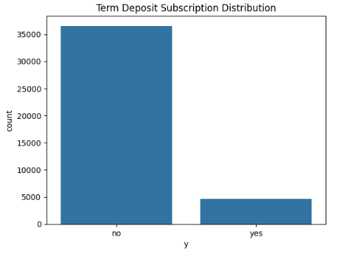

### Confusion Matrix

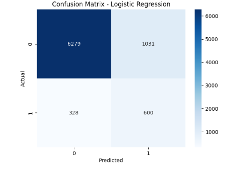

### ROC Curve

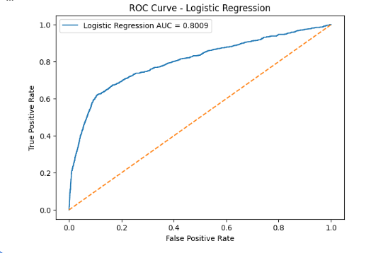

### SHAP Explanation

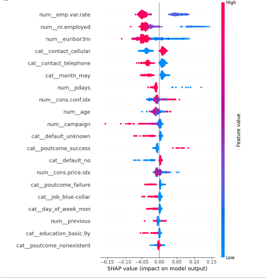

## Results and Findings

The classification models were able to identify patterns related to customer subscription behavior. Since the dataset is imbalanced, F1-Score and ROC-AUC were more meaningful than accuracy.

The most important modeling decision was removing the `duration` feature. Keeping it would create unrealistic results because it leaks post-call information into the model.

Key findings:

- Customer response to previous campaigns is usually a strong predictor.
- Economic indicators and campaign-related variables influence subscription likelihood.
- Random Forest generally provides stronger nonlinear modeling performance.
- Logistic Regression provides a useful interpretable baseline.
- SHAP explanations help show which features push a prediction toward subscription or non-subscription.

Business insight:

A bank should not use a raw model prediction alone. It should combine predicted subscription probability with campaign cost, customer value, and targeting strategy.

---

# Task 2: Customer Segmentation Using Unsupervised Learning

## Task Objective

The objective of this task is to segment mall customers based on their income and spending behavior, then suggest marketing strategies for each segment.

The project uses the **Mall Customers Dataset**.

## Approach

The task was completed through the following workflow:

1. Loaded and explored the Mall Customers Dataset.
2. Checked missing values, duplicates, column types, and customer distribution.
3. Encoded the gender column for analysis.
4. Conducted Exploratory Data Analysis on:
   - Gender
   - Age
   - Annual Income
   - Spending Score
   - Income vs Spending Score
5. Scaled numerical features using StandardScaler.
6. Applied K-Means Clustering.
7. Used the Elbow Method and Silhouette Score to choose the optimal number of clusters.
8. Visualized customer clusters using:
   - Scatter plots
   - PCA
   - t-SNE
9. Profiled each cluster and assigned business-friendly segment names.
10. Suggested marketing strategies for each customer segment.

## Important Visuals

### Elbow Method

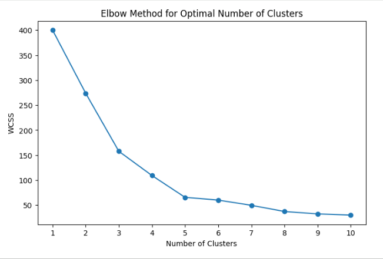

### Customer Clusters

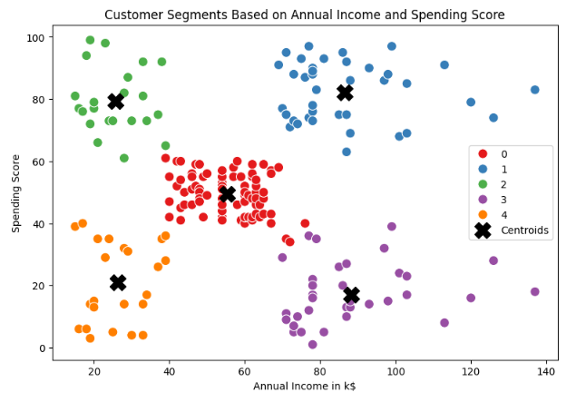

### PCA Cluster Visualization

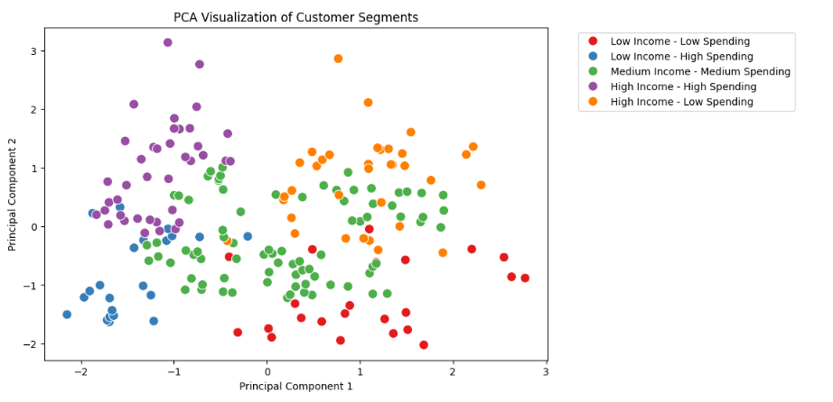

### Segment Distribution

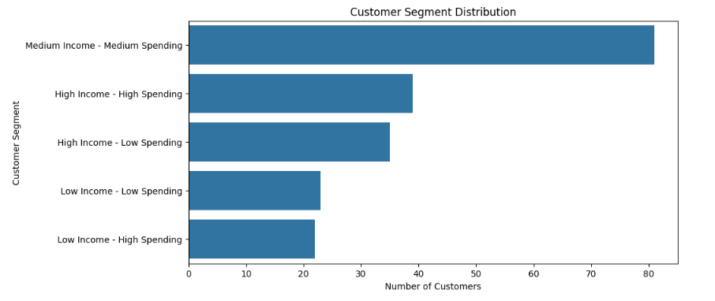

## Results and Findings

The K-Means model identified five meaningful customer segments:

1. High Income - High Spending
2. High Income - Low Spending
3. Low Income - High Spending
4. Low Income - Low Spending
5. Medium Income - Medium Spending

Key findings:

- High-income, high-spending customers are premium customers and should be targeted with loyalty benefits and exclusive offers.
- High-income, low-spending customers have strong conversion potential and should receive personalized campaigns.
- Low-income, high-spending customers respond well to discounts, bundles, and cashback offers.
- Low-income, low-spending customers should be targeted carefully with budget-friendly promotions.
- Medium-income, medium-spending customers can be gradually moved toward higher spending using cross-selling and loyalty programs.

Business insight:

Customer segmentation allows the business to stop using generic marketing. Each customer group needs a different strategy based on spending behavior and purchasing power.

---

# Task 3: Energy Consumption Time Series Forecasting

## Task Objective

The objective of this task is to forecast short-term household energy usage using historical time-based consumption patterns.

The project uses the **Household Power Consumption Dataset**.

## Approach

The task was completed through the following workflow:

1. Loaded the Household Power Consumption Dataset.
2. Combined date and time columns into a proper datetime index.
3. Converted numeric columns and handled missing values.
4. Resampled minute-level data into hourly energy consumption.
5. Conducted Exploratory Data Analysis on:
   - Overall energy usage trend
   - Daily average consumption
   - Monthly average consumption
   - Hourly usage patterns
   - Weekday vs weekend behavior
6. Engineered time-based features:
   - Hour of day
   - Day of week
   - Day of month
   - Month
   - Weekend indicator
   - Lag features
   - Rolling average features
7. Trained and compared three forecasting models:
   - ARIMA
   - Prophet
   - XGBoost
8. Evaluated model performance using:
   - MAE
   - RMSE
   - MAPE
9. Plotted actual vs forecasted energy usage.

## Important Visuals

### Energy Consumption Over Time

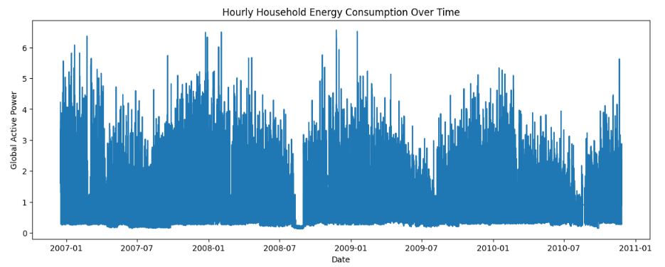

### Average Consumption by Hour

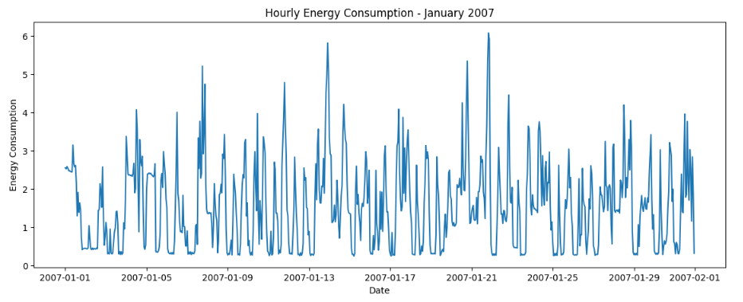

### Actual vs Forecasted Energy Usage

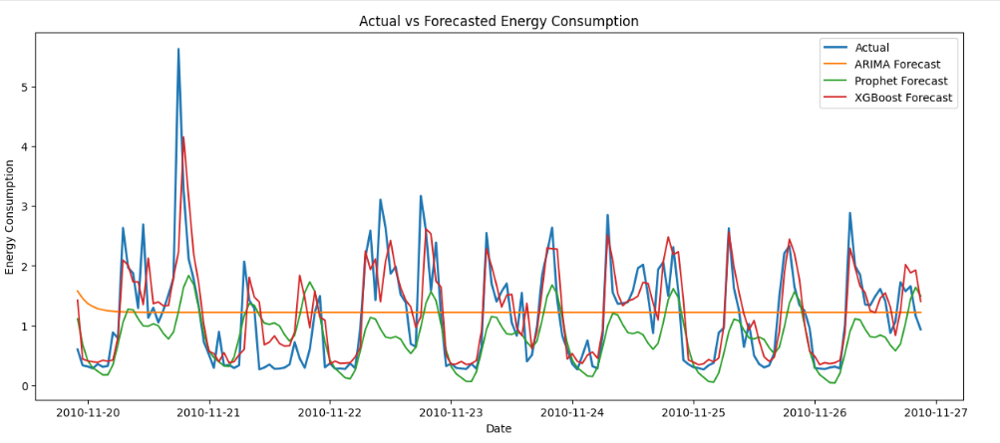

### Model Performance Comparison

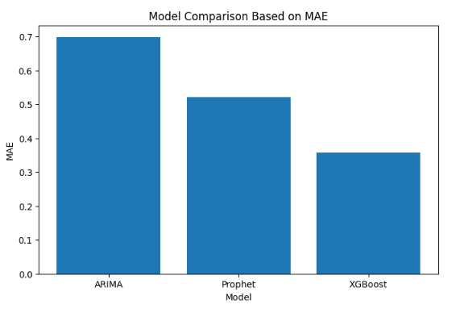

## Results and Findings

The forecasting models captured different aspects of household energy behavior.

Key findings:

- Household energy consumption follows visible daily and weekly patterns.
- Energy usage often varies by hour of day because of household routines.
- Lag features such as previous hour, previous day, and previous week consumption are useful for forecasting.
- ARIMA provides a classical statistical baseline.
- Prophet is useful for seasonality and trend modeling.
- XGBoost can perform strongly when lag and rolling features are properly engineered.

Business insight:

Short-term energy forecasting can support better demand planning, cost optimization, energy budgeting, and household consumption management.

Important modeling note:

Random train-test splitting was avoided because time-series forecasting must train on the past and predict the future. Random splitting would leak future information into training and produce misleading results.

---

# Task 4: Loan Default Risk with Business Cost Optimization

## Task Objective

The objective of this task is to predict loan default risk and optimize the classification threshold using business cost analysis.

The project uses the **Home Credit Default Risk Dataset**.

## Approach

The task was completed through the following workflow:

1. Loaded and explored the Home Credit Default Risk Dataset.
2. Checked target imbalance, missing values, data types, and feature distributions.
3. Dropped columns with very high missing values.
4. Fixed abnormal values in `DAYS_EMPLOYED`.
5. Created useful business features:
   - Age in years
   - Employment years
   - Credit-to-income ratio
   - Annuity-to-income ratio
   - Credit-to-goods ratio
6. Conducted Exploratory Data Analysis on:
   - Target distribution
   - Default rate by demographic features
   - Income distribution
   - Credit amount distribution
   - Credit-to-income ratio
   - Correlation with default
7. Trained two binary classification models:
   - Logistic Regression
   - CatBoost Classifier
8. Evaluated the models using:
   - Confusion Matrix
   - F1-Score
   - ROC-AUC
   - Precision-Recall Curve
9. Defined business cost values for:
   - False Positives
   - False Negatives
10. Tested multiple classification thresholds.
11. Selected the threshold that minimized total business cost.

## Important Visuals

### Target Distribution

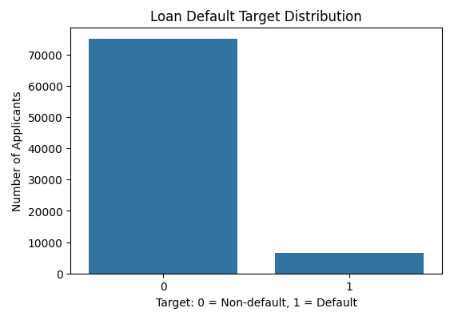

### ROC Curve

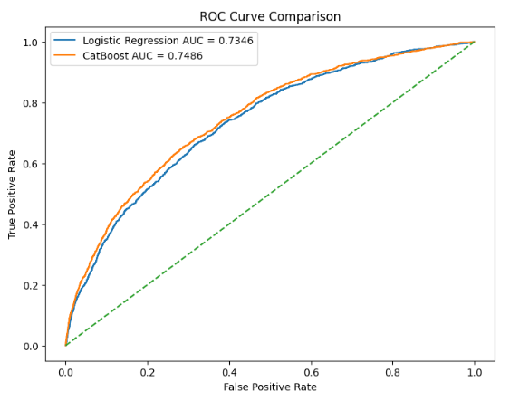

### Threshold vs Business Cost

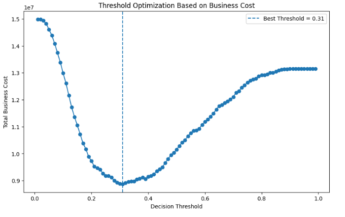

### Default Threshold vs Optimized Threshold Cost

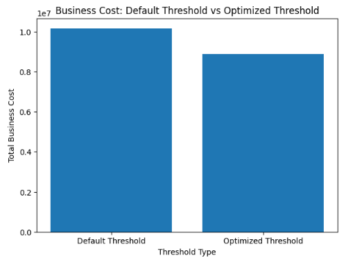

## Results and Findings

The dataset is highly imbalanced, so accuracy alone is not a reliable measure of model quality.

Key findings:

- Logistic Regression provides a useful baseline.
- CatBoost is more suitable for this dataset because it handles tabular data and categorical variables effectively.
- False negatives are more expensive than false positives in loan default prediction.
- A default threshold of 0.50 is not necessarily optimal.
- Business cost optimization provides a more realistic decision framework than accuracy optimization.

Business insight:

In loan default prediction, the best model is not simply the one with the highest accuracy. The best model is the one that minimizes financial loss.

A bank should choose the approval/rejection threshold based on expected loss, recovery rate, profit margin, and risk appetite.

---
